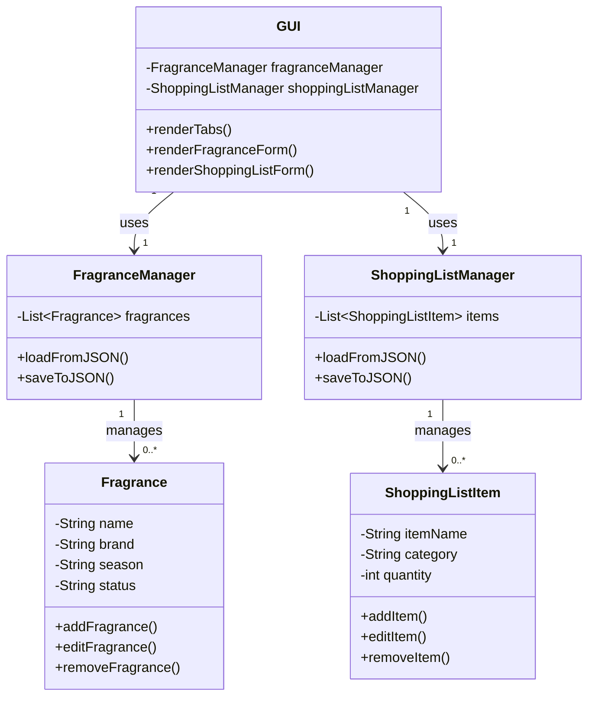
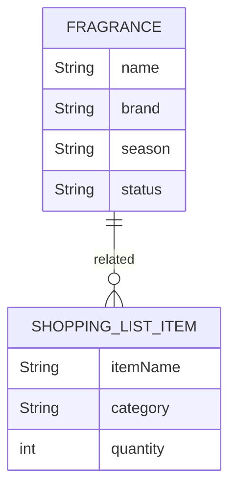

## **UML Class Diagram**
The UML Class Diagram represents the structure of the application, including classes, attributes, methods, and relationships.

#### **Explanation of UML Class Diagram**
1. **Fragrance Class**:
   - Represents a fragrance entry with attributes like `name`, `brand`, `season`, and `status`.
   - Methods include `addFragrance()`, `editFragrance()`, and `removeFragrance()` for managing individual fragrances.

2. **ShoppingListItem Class**:
   - Represents a shopping list item with attributes like `itemName`, `category`, and `quantity`.
   - Methods include `addItem()`, `editItem()`, and `removeItem()` for managing individual items.

3. **FragranceManager Class**:
   - Manages a collection of `Fragrance` objects.
   - Includes methods for loading and saving data to/from JSON (`loadFromJSON()`, `saveToJSON()`).

4. **ShoppingListManager Class**:
   - Manages a collection of `ShoppingListItem` objects.
   - Includes methods for loading and saving data to/from JSON (`loadFromJSON()`, `saveToJSON()`).

5. **GUI Class**:
   - Represents the graphical user interface built with Tkinter.
   - Uses `FragranceManager` and `ShoppingListManager` to interact with data.
   - Includes methods for rendering tabs and forms (`renderTabs()`, `renderFragranceForm()`, `renderShoppingListForm()`).

---

## **Entity Relationship Diagram (ERD)**
The ERD represents the relationships between entities (tables) in the data model.

#### **Explanation of ERD**
1. **FRAGRANCE Entity**:
   - Represents a fragrance entry with attributes:
     - `name`: Name of the fragrance.
     - `brand`: Brand of the fragrance.
     - `season`: Season associated with the fragrance.
     - `status`: Status of the fragrance (e.g., for event planning).

2. **SHOPPING_LIST_ITEM Entity**:
   - Represents a shopping list item with attributes:
     - `itemName`: Name of the item.
     - `category`: Category of the item.
     - `quantity`: Quantity of the item.

3. **Relationship**:
   - The `FRAGRANCE` entity is related to the `SHOPPING_LIST_ITEM` entity, indicating that fragrances and shopping list items are connected in the application (e.g., a fragrance might be added to a shopping list).

---

### **How the Diagrams Work Together**
- The **UML Class Diagram** focuses on the application's structure, including classes, methods, and their interactions.
- The **ERD** focuses on the data model and relationships between entities, which are stored in JSON format and managed by the `FragranceManager` and `ShoppingListManager` classes.

**Application Overview**

This Python program is designed to manage fragrance collections and shopping lists, utilizing the Tkinter library for the graphical user interface (GUI) and JSON for data storage. 

**Overview of the application’s structure:**

**Main Components:**  
The application consists of two primary functions:

1. **Fragrance Management:** This feature allows users to add, edit, and remove fragrances. Users can categorize fragrances by season and assign statuses for event planning.
  
2. **Shopping List Management:** This function enables users to manage shopping lists with similar capabilities to those of the fragrance management, including adding, editing, and removing items.

**Key Features**

1. **Data Model:**
   - **Fragrance:** An object representing a fragrance entry, with attributes such as name, brand, season, and status.
   - **ShoppingList:** An object representing a shopping list item, with attributes like item name, category, and quantity.  
   Manager classes will handle collections of these objects and will be responsible for loading and saving data in JSON format for persistence.

2. **GUI with Tkinter:**
   - **Tabs for Navigation:** The application will feature a tabbed interface, with one tab dedicated to managing fragrances and the other for shopping lists.
   - **Forms for Data Entry:** Users will fill out forms to enter information about fragrances or shopping list items, which will include fields for all relevant attributes.
   - **Update/Delete Options:** Users will have the ability to update or delete existing entries.

3. **Event Handling and Computation:**
   - **Age Calculation/Days Until:** The program will leverage Python’s datetime module to calculate the age of a fragrance or count down the days to an event or reminder date.

4. **Data Persistence with JSON:**
   - **Load/Save Functionality:** All data will be stored in JSON format for easy retrieval and storage. Each manager class will handle reading from and writing to JSON files to maintain data between user sessions.

---

> Written with [StackEdit](https://stackedit.io/).
