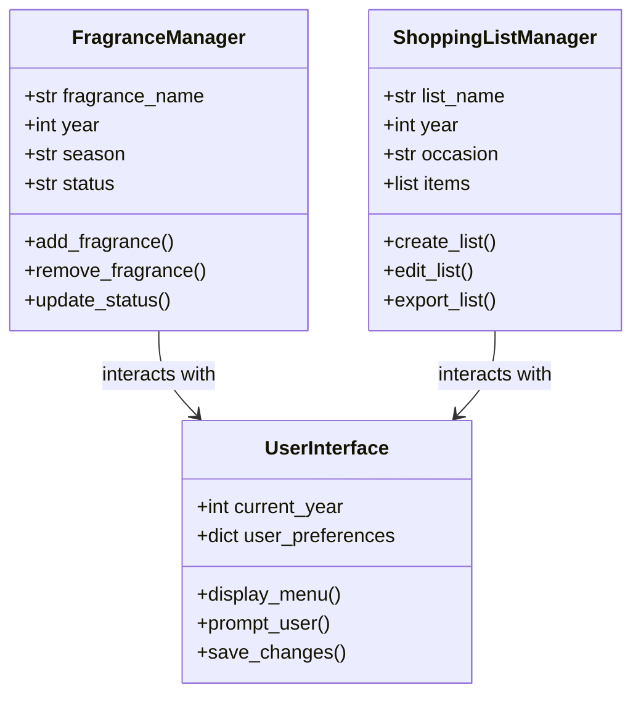
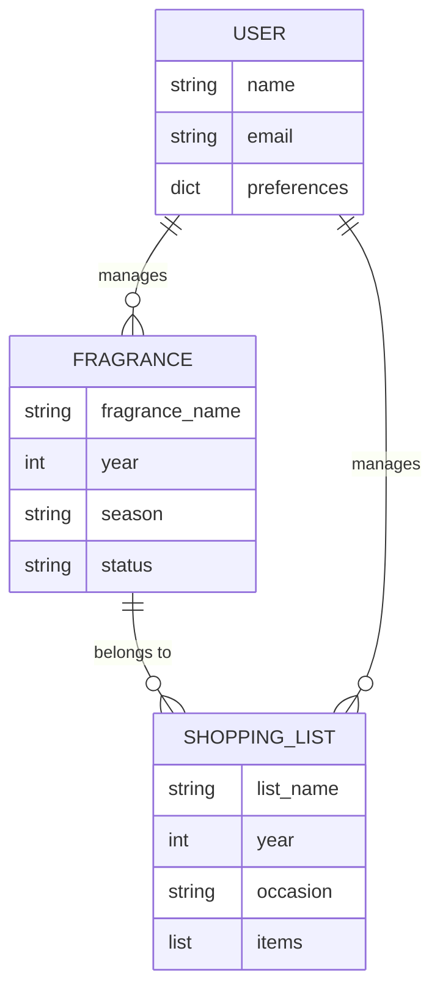


# Python Application for Bath & Body Works

## Header Section

### Client
**Bath & Body Works**  
This system is designed for Bath & Body Works customers to help with organizing and tracking a user's favorite fragrances.

### Scope of the System
The system will allow users to:
1. Log and categorize fragrances by year and season.
2. Create and manage shopping lists for birthdays, holidays, and special occasions.
3. Assign status labels to fragrances (e.g., "SHOPPING LIST," "I Have Not Smelled," "I Like This One").
4. Store and retrieve data using a JSON file.
5. Automatically calculate ages and birthdays for event planning.
6. Provide a user-friendly graphical interface for interaction.

The system will not include:
- Integration with external e-commerce platforms.
- Real-time inventory tracking from Bath & Body Works stores.

### Purpose of the System
The purpose of this system is to:
- Help users organize their fragrance preferences and shopping needs.
- Simplify event planning by linking shopping lists to specific occasions.
- Provide a centralized platform for tracking fragrance collections and shopping history.

---

## General Design of the System
The system will be designed as a desktop application with a graphical user interface (GUI). It will use object-oriented programming principles, with data stored in a JSON file for persistence. The application will feature three main classes:
1. **FragranceManager**: Manages the collection of fragrances and their attributes.
2. **ShoppingListManager**: Handles the creation, editing, and organization of shopping lists.
3. **UserInterface**: Provides the GUI for user interaction.

---

## Classes
1. **FragranceManager**
   - Attributes: `fragrance_name`, `year`, `season`, `status`
   - Methods: `add_fragrance()`, `remove_fragrance()`, `update_status()`

2. **ShoppingListManager**
   - Attributes: `list_name`, `year`, `occasion`, `items`
   - Methods: `create_list()`, `edit_list()`, `export_list()`

3. **UserInterface**
   - Attributes: `current_year`, `user_preferences`
   - Methods: `display_menu()`, `prompt_user()`, `save_changes()`

---

## UML Class Diagram (Mermaid)

---

## Entity Relationship Diagram (ERD) (Mermaid)

---

## Explanation of the Entity Relationship Diagram (ERD)
- **FRAGRANCE**: Represents a fragrance entry with attributes like name, year, season, and status.
- **SHOPPING_LIST**: Represents a shopping list with attributes like name, year, occasion, and items.
- **USER**: Represents the user who manages fragrances and shopping lists.
- Relationships:
  - A user can manage multiple fragrances and shopping lists.
  - A fragrance can belong to one or more shopping lists.

---

## Key Features
1. **Fragrance Collection Management**: Add, remove, and update fragrances.
2. **Seasonal Organization**: Categorize fragrances by year and season.
3. **Shopping List Integration**: Create lists for birthdays, holidays, and special events.
4. **Status Labels**: Assign custom statuses to fragrances.
5. **Data Storage & Retrieval**: Use JSON files for data persistence.
6. **Birthday Computation**: Automatically calculate ages and days until the next birthday.

---

## User Prompts & Actions
- Create and manage shopping lists.
- Open existing lists via a dropdown menu.
- Edit, export, or share lists.
- Enable notifications via phone or email.
- Confirm updates before exiting.

---

## Data Fields
- **Year & Month**: Organized by year, with individual months listed.
- **Day (01-31)**: Assign specific events or purchases to each day.
- **Name Format**: (Last, First) or (First, Last).
- **Age This Year**: Automatically calculated and displayed.

---

## Minimum Requirements
1. **Graphical User Interface**: Interact with at least three classes.
2. **Collections**: Use lists, tuples, arrays, and dictionaries.
3. **Error-Free Execution**: No syntax or runtime errors; correct results.
4. **Documentation**: Include a proposal, class diagram, and sample output.

---
